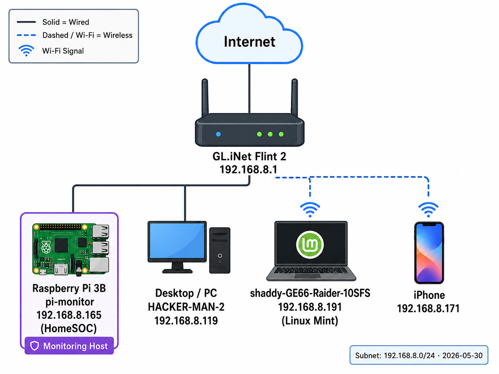

# HomeSOC

HomeSOC is a Raspberry Pi home network monitoring lab that I built to learn more about Linux, networking, automation, and basic security operations.

The goal is to keep track of the devices on my home network, monitor changes over time, and build documentation and workflows similar to what you might see in a small MSP or entry-level SOC environment.

## Status

Currently in development.

Working features:

* Network discovery using `arp-scan`
* SQLite asset inventory
* Device tracking by MAC address
* Manual review process for new devices
* Initial runbook documentation

Planned features:

* Scheduled scans with cron
* Syslog collection from the Flint 2 router
* Basic alert detection
* Flask dashboard
* Additional runbooks and incident documentation

## Network

### Hardware

* Raspberry Pi 3 Model B v1.2
* GL.iNet Flint 2 router
* Home LAN: 192.168.8.0/24

### Software

* Raspberry Pi OS
* Python 3
* SQLite
* arp-scan
* Git

## What it does

The Raspberry Pi sits on my home network and runs discovery scans using `arp-scan`.

When a scan runs, the script:

1. Finds devices on the network
2. Collects IP address, MAC address, and vendor information
3. Stores the results in a SQLite database
4. Updates existing devices if they have already been seen
5. Flags new devices for review

The Pi automatically identifies itself so it doesn't generate alerts for its own MAC address.

When a new device is detected, I review it, identify what it is, and update the inventory with information such as owner, device type, and approval status.

## Project Structure

| Path                       | Purpose                          |
| -------------------------- | -------------------------------- |
| `scanners/discovery.py`    | Network discovery script         |
| `db/schema.sql`            | Database schema                  |
| `docs/asset-register.md`   | Device inventory                 |
| `docs/network-diagram.png` | Network diagram                  |
| `docs/runbooks/`           | Procedures and documentation     |
| `collectors/`              | Future log collection            |
| `alerts/`                  | Future alerting logic            |
| `dashboard/`               | Future dashboard                 |
| `evidence/`                | Screenshots and project evidence |

## Current Workflow

1. Run a network scan
2. Save the scan to SQLite
3. Update device records
4. Flag any new devices
5. Review unknown devices
6. Update inventory and documentation

## Future Goals

* Automatic scheduled scans
* Router log collection
* Detection rules for suspicious activity
* Alert reporting
* Dashboard for device and alert visibility
* Additional runbooks for common scenarios

## Why I Built It

I wanted a project that was more than just running security tools manually.

HomeSOC gives me a place to practice Linux administration, networking, monitoring, documentation, scripting, and basic security operations using my own home network.

## Scope

This project only runs on my own home network and is intended for learning and portfolio development.

